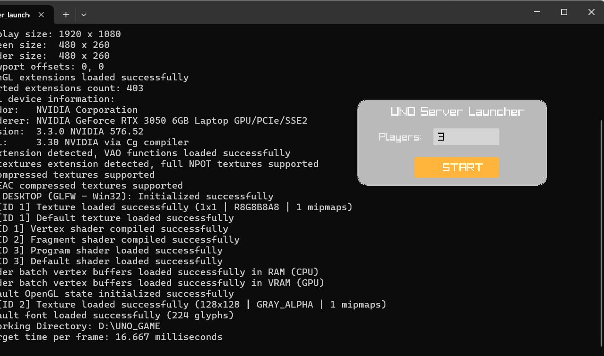
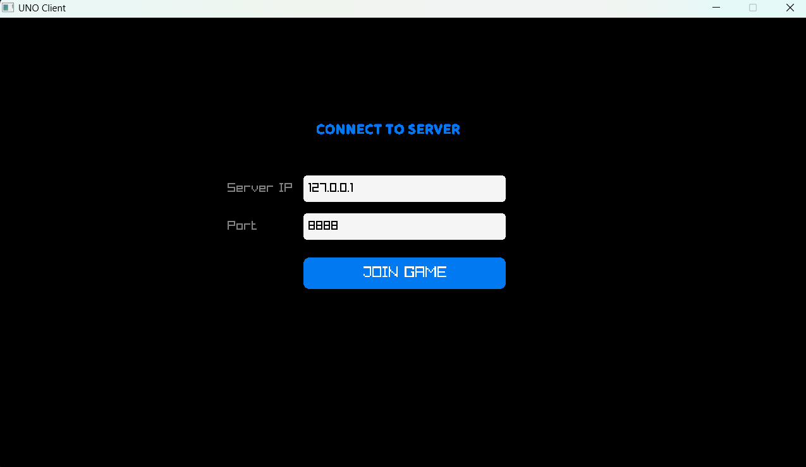

# UNO Multiplayer Game — Networked Card Game in C

> A **real-time multiplayer UNO card game** built in **C**, implementing a  
> **client–server architecture** using **TCP sockets (Winsock)**.  
> Designed to demonstrate **low-level networking**, **multithreading**, and  
> **game state synchronization**.
  
---  
## Demo   

&emsp;&emsp;&emsp;&emsp;&emsp;  
  
  
---  

---

## Why This Project Stands Out

-  Built **from scratch in C**
-  Real-time **multiplayer networking**
-  **Thread-safe** server architecture
-  Custom **binary protocol & serialization**
-  Strong focus on **systems programming**

---

## Gameplay Overview

- Multiplayer UNO with **2–N players**
- Server acts as the **single source of truth**
- Clients send only **actions**, not game state
- Server validates moves and broadcasts updates
- First player to empty their hand wins 

---

## Features

### Core Gameplay
- Standard UNO rules
- Reverse
- Skip
- Draw Two
- Wild & Wild Draw Four
- UNO call timeout enforcement

### Networking
- TCP client–server communication
- Multithreaded server (one thread per client)
- Custom packet serialization / deserialization
- Centralized rule validation

### System Design
- Centralized game state
- Deterministic turn handling
- Timeout-based penalties
- Robust synchronization logic

---

## Tech Stack

| Component | Technology |
|---------|------------|
| Language | C |
| Networking | Winsock2 (TCP) |
| Concurrency | Windows Threads |
| Platform | Windows |
| Build Tools | GCC / MSVC |

---

## Project Structure

```text
UNO/
├── server.c              # Multithreaded game server
├── client.c              # Client-side gameplay
├── game2.h               # Game rules & state machine
├── serializer.h          # Binary serialization
├── shared_protocol.h     # Network protocol definition
├── cards.h               # Card & deck structures
├── utils.c               # Utility helpers
└── README.md             # Documentation    
```  
  
## Running and Compiling  
For client :  
gcc client.c helpers_ui.c player_hand.c -o client.exe -Iinclude -Llib -lraylib -lwinmm -lgdi32 -lws2_32    
  
For server :  
gcc server.c game2.c deck2.c player.c player_hand.c -o server.exe -lws2_32   

### OR  
  
you can directly open server_launcher.exe and client.exe , get the ip of server device , enter the ip into client.exe and you are ready to go  
    
Connect all the devices with a single network (LAN connection)  
The game best runs when there are 3 or more player , there are still some issues when 2 players play. Make sure the game never starts with a power card if it does then restart the game.  
Join the game only after the server side is setup . 
      

## Author  
  
**Manan**  
Computer Science Student  
  
Interests:  
Systems Programming  
Game Development  
Networking & Security